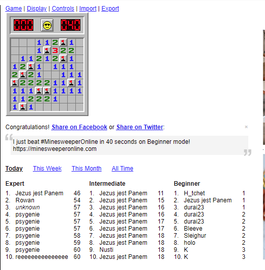

# Minsweeper Bot

I am creating a bot that plays Minesweeper from this website: https://minesweeperonline.com

This bot uses selenium to interact with the game. I am trying to optimize the speed of this program.

## Version 1

* can beat simple 9 x 9 games
* logic for flagging works for most scenarios, but needs to cover more conditions

* a bit slower because it checks each cell, even in areas that are complete

## Version 2 (in progress)

* works for any grid size 
* uses a queue to 